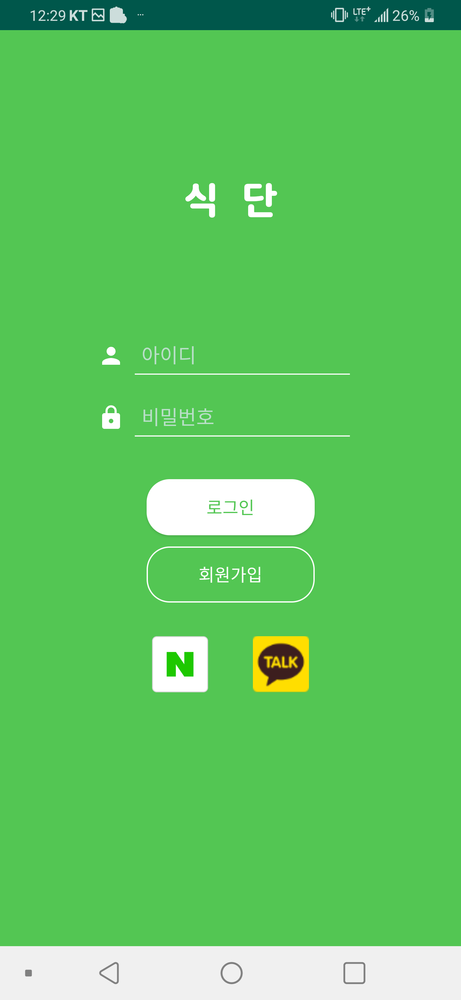
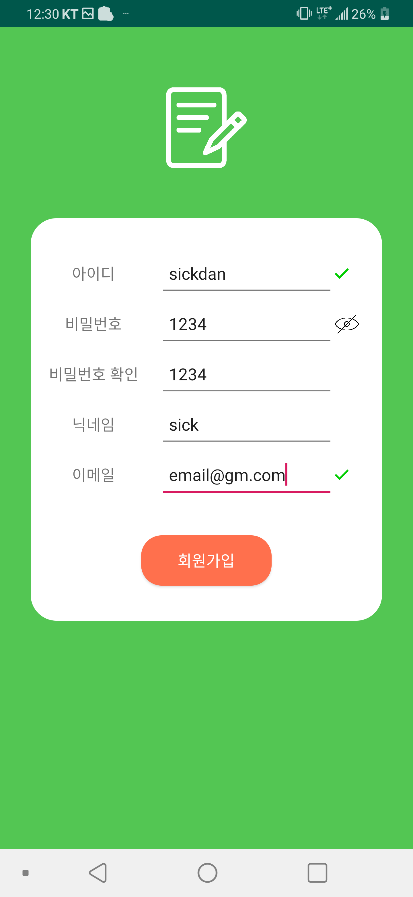
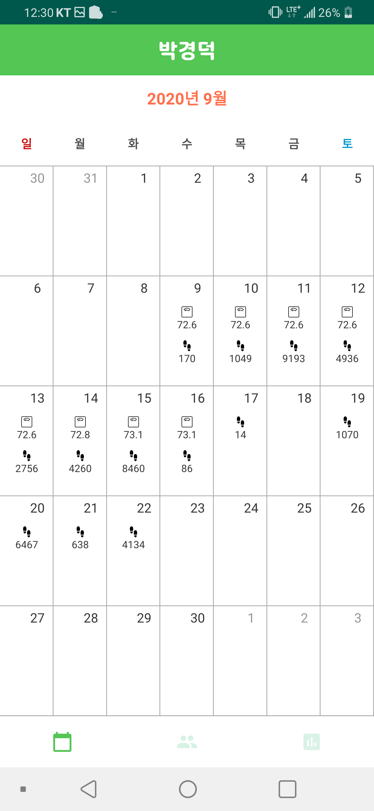
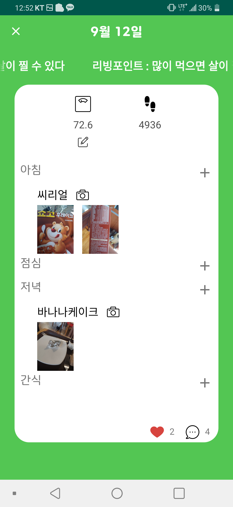
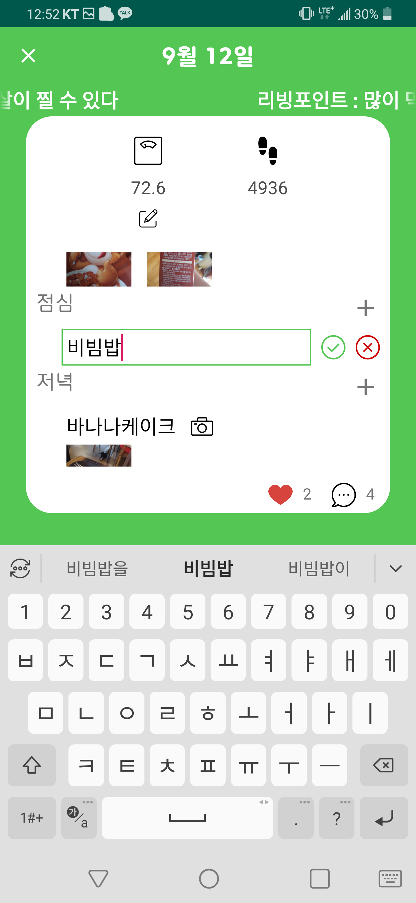
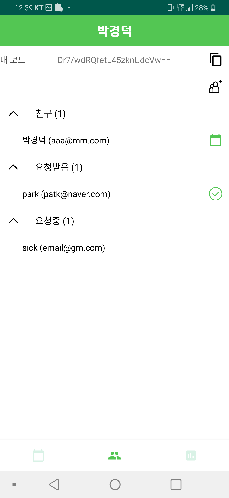
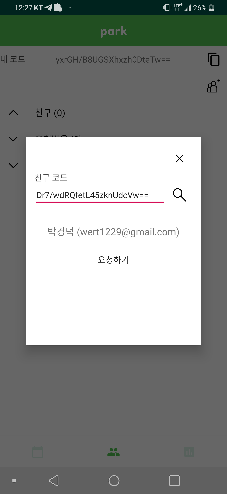
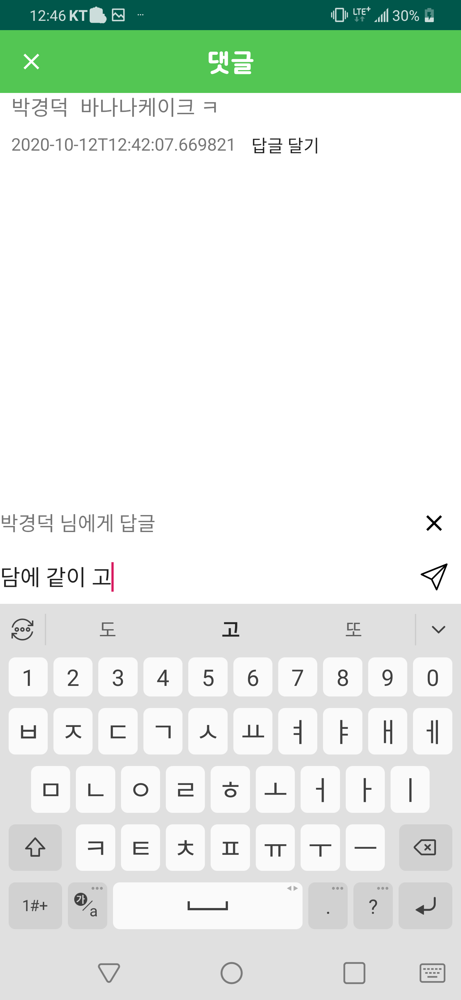
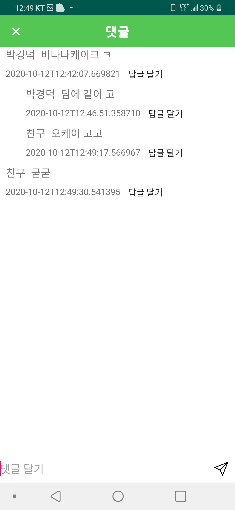

# Sickdan
| &nbsp;  | &nbsp; |  &nbsp; | &nbsp; |  &nbsp;  |
| ------------- | ------------- | ------------- | ------------- | ------------- |
|   |   |  |   |  |
|   |   |  |   |  |

## 설명
#### 간단한 달력 형식의 포멧에 하루 식단과 몸무게 등을 기록하고 만보기 기능을 제공하는 프로그램
#### 추가로 친구 기능으로 친구와 서로의 기록을 공유, 평가함으로써 
#### 자신과 친구의 식단 계획 이행률을 높힐 수 있다.

## 서버
- https://github.com/wert1229/sickdan-api-server
* Spring Boot
* Spring Security
* JWT
* JPA(Hibernate)
* MariaDB
* Redis
* Docker
* Jenkins
* AWS(S3, Cloudfront, RDS)
* JUnit5

## 클라이언트
- https://github.com/wert1229/sickdan-android-client
* Android(Java)
* MVVM
